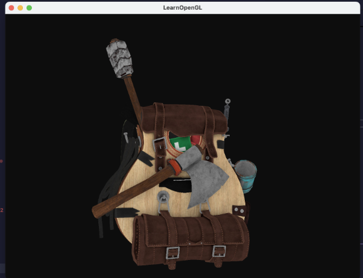

# 计算机图形学第二次平时作业

**姓名**：韩东时

**学号**：202311998063

**代码仓库**：目录下的 [lab4～lab6](./) 以及 [GitHub 仓库](https://github.com/ficrbay/opengllab)


## 一、实验环境

1. **Visual Studio Code**
   使用 VS Code 作为主要开发工具，便于跨平台编程与调试，具备强大的插件生态，适用于 Python 和C++相关实验的开发。

2. **macOS 操作系统**
   本次实验在 macOS 系统上完成，环境稳定，兼容性好，适合图形学相关实验。

3. **Conda 虚拟环境**
   使用 Anaconda 管理 Python 依赖与运行环境，创建独立的实验环境，确保依赖一致性，避免库冲突。

4. **DensePose 环境配置**
   已配置 DensePose 相关依赖，包括 chumpy 和 detectron 等 Python 包，便于 DensePose 模型的运行。

5. **Matplotlib 和 OpenCV 库**
   实验过程中使用 Matplotlib 实现数据与图像的可视化，OpenCV 实现图像处理功能。
6. **CMakeList配置** ：
   **lab5**:
   ```cmake
   cmake_minimum_required(VERSION 3.10)
   project(OpenGL_Project)

   set(CMAKE_CXX_STANDARD 17)
   set(CMAKE_CXX_STANDARD_REQUIRED ON)
   set(BREW_PREFIX "/opt/homebrew")

   include_directories(
      ${PROJECT_SOURCE_DIR}/include
      ${PROJECT_SOURCE_DIR}/learnopengl
      ${BREW_PREFIX}/include
   )

   link_directories(${BREW_PREFIX}/lib)

   find_library(OPENGL_LIBRARY OpenGL)
   find_package(PkgConfig REQUIRED)
   pkg_search_module(GLFW REQUIRED glfw3)
   find_path(GLM_INCLUDE_DIR glm/glm.hpp HINTS ${BREW_PREFIX}/include)
   find_path(ASSIMP_INCLUDE_DIR assimp/Importer.hpp HINTS ${BREW_PREFIX}/include)
   find_library(ASSIMP_LIBRARY assimp HINTS ${BREW_PREFIX}/lib)

   file(GLOB SRC_FILES
      ${PROJECT_SOURCE_DIR}/src/*.cpp
      ${PROJECT_SOURCE_DIR}/src/glad.c
      ${PROJECT_SOURCE_DIR}/src/stb_image.h)

   add_definitions(-DGL_SILENCE_DEPRECATION)

   add_executable(OpenGL_Project ${SRC_FILES})

   add_custom_command(TARGET OpenGL_Project POST_BUILD
      COMMAND ${CMAKE_COMMAND} -E copy_directory
      ${PROJECT_SOURCE_DIR}/backpack
      $<TARGET_FILE_DIR:OpenGL_Project>/backpack)

      add_custom_command(TARGET OpenGL_Project POST_BUILD
      COMMAND ${CMAKE_COMMAND} -E copy_directory
      ${PROJECT_SOURCE_DIR}/shaders
      $<TARGET_FILE_DIR:OpenGL_Project>/shaders)

   target_link_libraries(OpenGL_Project
      ${OPENGL_LIBRARY}
      ${GLFW_LIBRARIES}
      ${ASSIMP_LIBRARY})
    ```
    **lab6**:
    ```cmake
    cmake_minimum_required(VERSION 3.10)
   project(OpenGL_Project)

   set(CMAKE_CXX_STANDARD 17)
   set(CMAKE_CXX_STANDARD_REQUIRED ON)

   set(BREW_PREFIX "/opt/homebrew")

   include_directories(
      ${PROJECT_SOURCE_DIR}/include
      ${PROJECT_SOURCE_DIR}/learnopengl
      ${BREW_PREFIX}/include
   )

   link_directories(${BREW_PREFIX}/lib)

   find_library(OPENGL_LIBRARY OpenGL)
   find_package(PkgConfig REQUIRED)
   pkg_search_module(GLFW REQUIRED glfw3)
   find_library(ASSIMP_LIBRARY assimp HINTS ${BREW_PREFIX}/lib)

   file(GLOB SRC_FILES
      ${PROJECT_SOURCE_DIR}/src/*.cpp
      ${PROJECT_SOURCE_DIR}/src/glad.c
      ${PROJECT_SOURCE_DIR}/src/texture_utils.cpp)  # 加载纹理辅助函数

   add_definitions(-DGL_SILENCE_DEPRECATION)

   add_executable(OpenGL_Project ${SRC_FILES})

   add_custom_command(TARGET OpenGL_Project POST_BUILD
      COMMAND ${CMAKE_COMMAND} -E copy_directory
               ${PROJECT_SOURCE_DIR}/backpack
               $<TARGET_FILE_DIR:OpenGL_Project>/backpack)

   add_custom_command(TARGET OpenGL_Project POST_BUILD
      COMMAND ${CMAKE_COMMAND} -E copy_directory
               ${PROJECT_SOURCE_DIR}/shaders
               $<TARGET_FILE_DIR:OpenGL_Project>/shaders)

   add_custom_command(TARGET OpenGL_Project POST_BUILD
      COMMAND ${CMAKE_COMMAND} -E copy_directory
               ${PROJECT_SOURCE_DIR}/textures
               $<TARGET_FILE_DIR:OpenGL_Project>/textures)

   add_custom_command(TARGET OpenGL_Project POST_BUILD
      COMMAND ${CMAKE_COMMAND} -E copy_directory
               ${PROJECT_SOURCE_DIR}/skybox
               $<TARGET_FILE_DIR:OpenGL_Project>/skybox)

   target_link_libraries(OpenGL_Project
      ${OPENGL_LIBRARY}
      ${GLFW_LIBRARIES}
      ${ASSIMP_LIBRARY})
   ```

---

## 二、实验内容

### 1. 网格参数化（共30分）

### a) 可视化 SMPL 模型手部关键点（10分）

本部分实验通过 3D 可视化手段观察 SMPL 模型中右手部位的顶点分布情况。代码基于 `matplotlib` 的三维绘图模块完成。

#### 关键代码说明

```python
ax = fig.add_subplot(111, projection='3d')
ax.scatter(Z, X, Y, s=0.2, c='k')
smpl_view_set_axis_face2(ax, 0, -90)  # 方位角 0°, 仰角 -90°，实现俯视观察
plt.title('Right hand (SMPL)')
```

* `ax.view_init(elev, azimuth)`：用于设置观察角度。`elev = -90` 表示俯视角度。
* `ax.set_xlim` / `set_ylim` / `set_zlim`：控制显示范围，精确聚焦于右手区域。
* `ax.scatter()`：绘制 SMPL 顶点数据，点大小 `s=0.2`，颜色为黑色。

```python
def smpl_view_set_axis_face2(ax, azimuth=0, elev=0):
    ax.view_init(elev, azimuth)
    max_range = 0.1
    ax.set_xlim(0 - max_range, 0 + max_range)
    ax.set_ylim(0.7 - max_range, 0.7 + max_range)
    ax.set_zlim(-3 - max_range, -3 + max_range)
    ax.axis('off')
```

#### 实验结果截图与说明

从图中可以看出，SMPL 模型手部区域被精确聚焦并以三维散点形式清晰显示。各个手指以及手掌的点云分布密集，验证了 SMPL 模型在手部细节建模上的准确性与完整性。


### b) 可视化人体关键点与对应的标注 IUV（10分）

本部分实验通过解析 DensePose 标注文件，提取每个关键点的 IUV 信息并进行可视化，展示了人体不同部位对应的纹理坐标。

#### 关键代码说明：

```python
Point_x = np.array(ann['dp_x']) / 255. * bbr[2]
Point_y = np.array(ann['dp_y']) / 255. * bbr[3]
Point_I = np.array(ann['dp_I'])
Point_U = np.array(ann['dp_U'])
Point_V = np.array(ann['dp_V'])
```

* `Point_I`：表示人体的24个部位编号（patch index），范围为1\~24；
* `Point_U`, `Point_V`：表示该点在纹理图子块中的归一化坐标（0\~1）；
* 通过将 `(x, y)` 映射回图像坐标后，用 `plt.scatter` 可视化 I/U/V 值：

```python
plt.scatter(Point_x, Point_y, 22, Point_I)  # Patch index
plt.scatter(Point_x, Point_y, 22, Point_U)  # U坐标
plt.scatter(Point_x, Point_y, 22, Point_V)  # V坐标
```

#### 实验结果展示：

* 第一张图展示 patch index（I），可观察到各人体区域的分类；
* 第二张图展示 U 坐标的分布；
* 第三张图展示 V 坐标的分布。

### c) 替换人体纹理（10分）

该部分在构建稠密 IUV 映射的基础上，将一张标准纹理图（SURREAL texture）映射到选定人体图像的各部位，实现纹理替换。

#### 关键代码说明：

* 首先扩大每个稀疏关键点的影响范围（14×14）：

```python
for dx in range(-14, 14):
    for dy in range(-14, 14):
        I_im[yyy, xxx] = int(i)
        U_im[yyy, xxx] = int(u * 199)
        V_im[yyy, xxx] = int(v * 199)
```

* 接着将 I/U/V 合成三通道图像，并切分纹理图集：

```python
IUV = np.stack([I_im, U_im, V_im], axis=2).astype(np.uint8)
```

* 调用 `TransferTexture()` 实现纹理映射：

```python
new_im = im.astype(np.float32) / 255.0  # 初始化为原图
new_im[mask] = tex[V_part, U_part]     # 映射纹理块
```

#### 实验结果展示：

图像中可以观察到，人体区域已被纹理图替换。


### 2.实验内容：模型加载与材质

#### a) 加载带材质信息的固定模型（10 分）

我们使用 `Assimp` 加载 `backpack.obj` 模型，它包含材质文件 `.mtl`，自动加载漫反射纹理 `diffuse.jpg` 和镜面反射纹理 `specular.jpg`。通过如下代码完成加载：

```cpp
Model ourModel(FileSystem::getPath("./backpack/backpack.obj"));
```

效果图如下：



#### b) 可视化模型的漫反射与镜面反射材质（10 分）

我们单独展示三种材质效果：

**① 仅开启漫反射：**

```cpp
lightingShader.setVec3("light.ambient", 0.0f, 0.0f, 0.0f);
lightingShader.setVec3("light.diffuse", 1.0f, 1.0f, 1.0f);
lightingShader.setVec3("light.specular", 0.0f, 0.0f, 0.0f);
```


**② 仅开启镜面反射：**

```cpp
lightingShader.setVec3("light.ambient", 0.0f, 0.0f, 0.0f);
lightingShader.setVec3("light.diffuse", 0.0f, 0.0f, 0.0f);
lightingShader.setVec3("light.specular", 1.0f, 1.0f, 1.0f);
```


**③ 开启漫反射 + 镜面反射：**

```cpp
lightingShader.setVec3("light.ambient", 0.1f, 0.1f, 0.1f);
lightingShader.setVec3("light.diffuse", 1.0f, 1.0f, 1.0f);
lightingShader.setVec3("light.specular", 1.0f, 1.0f, 1.0f);
```


#### c) 渲染模型在点光源下的漫反射与镜面反射（15 分）

我们设置一个点光源打在吉他模型上，并渲染其照明效果：

**光源位置和参数：**

```cpp
glm::vec3 lightPos(1.2f, 1.0f, 2.0f);
lightingShader.setVec3("light.position", lightPos);
lightingShader.setFloat("light.constant", 1.0f);
lightingShader.setFloat("light.linear", 0.09f);
lightingShader.setFloat("light.quadratic", 0.032f);
```

**光照材质反应：**

```cpp
lightingShader.setFloat("material.shininess", 32.0f);
```

**光源立方体表示：**

```cpp
model = glm::translate(glm::mat4(1.0f), lightPos);
model = glm::scale(model, glm::vec3(0.2f));
lightCubeShader.setMat4("model", model);
```

最终光照效果如下图所示：

**漫反射**：


**镜面反射**：


**混合**：


### 实验内容：环境加载与几何图元（共 35 分）

#### a) 为模型加载背景与地面（10 分）

本节通过加载天空盒作为背景，并添加带有纹理的平面作为地面，从而构建出完整的三维场景环境。

**背景实现（天空盒）：**

* 使用立方体贴图加载 6 张图像，创建全天空盒视觉效果：

```cpp
vector<std::string> faces {
    "skybox/right.jpg", "skybox/left.jpg", "skybox/top.jpg",
    "skybox/bottom.jpg", "skybox/front.jpg", "skybox/back.jpg"
};
unsigned int cubemapTex = loadCubemap(faces);
```

* 使用 `skyboxShader` 着色器，将摄像机视角传入，绘制立方体作为背景：

```cpp
skyboxShader.use();
skyboxShader.setMat4("view", glm::mat4(glm::mat3(view)));
skyboxShader.setMat4("projection", projection);
```

**地面实现：**

* 构建一个 10x10 纹理平面：

```cpp
float planeVertices[] = {
    // pos                // tex
     10.0f, -1.8f,  10.0f,  4.0f, 0.0f,
    -10.0f, -1.8f,  10.0f,  0.0f, 0.0f,
    -10.0f, -1.8f, -10.0f,  0.0f, 4.0f,
     10.0f, -1.8f,  10.0f,  4.0f, 0.0f,
    -10.0f, -1.8f, -10.0f,  0.0f, 4.0f,
     10.0f, -1.8f, -10.0f,  4.0f, 4.0f
};
```

* 地面纹理加载与渲染：

```cpp
unsigned int floorTex = loadTexture("textures/ground.jpg");
floorShader.use();
floorShader.setMat4("model", glm::mat4(1.0f));
```

**效果展示：（地面的纹理图是我自己找的）**


---

#### b) 调整位置，得到完整场景（10 分）

为了防止穿模，需对模型和地面的位置进行手动调整，使其完整贴合。

**关键调整：**

* 模型下移：

```cpp
model = glm::translate(model, glm::vec3(0.0f, -0.5f, 0.0f));
```

* 地面下沉：

```cpp
// 地面 y 坐标由 -1.0f 改为 -1.8f
```

* 地面与模型对齐：

```cpp
grassShader.setMat4("model", glm::translate(glm::mat4(1.0f), glm::vec3(0.0f, -1.8f, 0.0f)));
```

**效果图展示：**


---

#### c) 渲染简单的几何图元前景（15 分）

本节使用几何着色器生成多个草叶图元，作为模型前景的视觉装饰。

**顶点数据（主程序）：**

```cpp
float grassPoints[] = {
    -2.0f, -1.8f, 2.0f, 0.2f, 0.8f, 0.2f,
     2.0f, -1.8f, 2.0f, 0.2f, 0.8f, 0.2f,
    -2.0f, -1.8f, -2.0f, 0.2f, 0.8f, 0.2f,
     2.0f, -1.8f, -2.0f, 0.2f, 0.8f, 0.2f,
     0.0f, -1.8f, 0.0f, 0.2f, 0.8f, 0.2f,
     0.0f, -1.8f, -3.0f, 0.2f, 0.8f, 0.2f
};
```

**几何着色器 grass.gs：**

```glsl
layout (points) in;
layout (triangle_strip, max_vertices = 4) out;
in vec3 fColor[];
out vec3 gColor;

void main() {
    vec4 base = gl_in[0].gl_Position;
    gColor = fColor[0];

    gl_Position = base;
    EmitVertex();
    gl_Position = base + vec4(-0.1, 0.6, 0.0, 0.0);
    EmitVertex();
    gl_Position = base + vec4( 0.1, 0.6, 0.0, 0.0);
    EmitVertex();
    gl_Position = base;
    EmitVertex();

    EndPrimitive();
}
```

**grass.vs 着色器：**

```glsl
layout (location = 0) in vec3 aPos;
layout (location = 1) in vec3 aColor;
out vec3 fColor;

uniform mat4 model;
uniform mat4 view;
uniform mat4 projection;

void main() {
    fColor = aColor;
    gl_Position = projection * view * model * vec4(aPos, 1.0);
}
```

**grass.fs 片元着色器：**

```glsl
in vec3 gColor;
out vec4 FragColor;
void main() {
    FragColor = vec4(gColor, 1.0);
}
```

**主程序中初始化：**

```cpp
Shader grassShader("shaders/grass.vs", "shaders/grass.fs", "shaders/grass.gs");
...
glGenVertexArrays(1, &grassVAO);
glGenBuffers(1, &grassVBO);
glBindVertexArray(grassVAO);
glBindBuffer(GL_ARRAY_BUFFER, grassVBO);
glBufferData(GL_ARRAY_BUFFER, sizeof(grassPoints), grassPoints, GL_STATIC_DRAW);

// position
glVertexAttribPointer(0, 3, GL_FLOAT, GL_FALSE, 6 * sizeof(float), (void *)0);
glEnableVertexAttribArray(0);

// color
glVertexAttribPointer(1, 3, GL_FLOAT, GL_FALSE, 6 * sizeof(float), (void *)(3 * sizeof(float)));
glEnableVertexAttribArray(1);
```

**绘制：**

```cpp
grassShader.use();
grassShader.setMat4("view", view);
grassShader.setMat4("projection", projection);
grassShader.setMat4("model", glm::mat4(1.0f));
glBindVertexArray(grassVAO);
glDrawArrays(GL_POINTS, 0, 6);
```

**效果展示：**


## 三、总结

### 网格参数化

在本次实验中，我围绕 SMPL 模型与 DensePose 标注完成了人体网格的参数化处理与纹理映射任务。首先，通过加载 SMPL 模型 `.pkl` 文件，我成功可视化了 T-pose 状态下的三维人体结构，提取了顶点信息并使用 `matplotlib` 实现了多视角的三维散点展示。在手部可视化任务中，我通过 `ax.view_init()` 和 `ax.set_xlim()` 等函数精准设定视角与裁剪范围，使右手区域在图中清晰展示，验证了模型在细节区域的建模精度。

在 IUV 映射任务中，我使用 DensePose 提供的 `dp_x, dp_y, dp_I, dp_U, dp_V` 五组标注数据完成图像中的散点可视化，并构建稠密的 IUV 图像以进行纹理映射。实验中，我将关键点的局部坐标扩大至 14×14 的邻域块，提升贴图覆盖率，避免过度稀疏。同时使用标准纹理图 atlas 分块后映射到不同人体部位，在实现 `TransferTexture()` 函数时，我将原图与纹理图融合，保留背景区域未被覆盖的图像内容。

调试过程中，主要遇到的问题包括纹理区域不连续、部分贴图缺失和背景区域异常变黑。最终通过扩张稀疏点、调整纹理坐标归一化倍数（U/V × 199）、保留原图背景等策略解决，顺利完成了从标注到完整纹理替换的人体网格参数化实验。

### 模型加载与材质

在本实验中，我首先完成了模型的加载，并使用 Assimp 库导入了一个包含完整材质信息的背包模型。加载过程中，我通过 `Model` 类将 `.obj` 文件解析为可用于 OpenGL 渲染的数据结构，包含顶点坐标、法线、纹理坐标及材质贴图信息。为了准确显示材质中的漫反射与镜面反射效果，我对 fragment shader 中的材质参数进行了配置，设置了 `material.ambient`、`material.diffuse`、`material.specular` 和 `material.shininess` 等属性。同时，我构建了一个点光源，并在渲染循环中传入光照的位置和颜色信息，使得模型表面在不同角度下呈现出真实的光照反应。调试中遇到的问题包括模型材质加载失败、渲染出黑色或材质失效等，最终通过修复路径引用和确保光源设置合理、材质属性设置完整得以解决。

### 环境加载与几何图元

为营造完整的三维场景，我引入了天空盒与地面纹理作为背景。其中天空盒使用六张图片构建立方体贴图，并在片元着色器中进行采样实现 360 度包裹式视野。地面则采用一块带有纹理坐标的大平面，并通过纹理图案（ground.jpg）进行装饰，使整个场景更具真实感。为了增加前景元素，我使用了几何着色器渲染绿色三角形草地图元，输入为少量 `GL_POINTS`，每个点在几何着色器中扩展为四个顶点构成的图元，并根据传入的颜色着色。初期草地悬浮在空中，通过调整顶点的 y 坐标（统一设为与地面相同的 `-1.8f`）解决贴地问题。渲染时还启用了深度测试和适当的透明度混合，以提升图形表现力。

### 多视角渲染与展示

为了展示完整场景构建的效果，我设计了一个三视角轮播系统，通过定时器机制每隔几秒切换一次视角。三个视角分别来自模型左前方、用户交互视角（摄像机）和右上方俯视角。视角的切换通过更新 `view` 矩阵中的观察位置与目标点实现，配合 `perspective` 投影构建真实透视画面。该功能显著增强了演示效果，使整个实验的空间构造更加直观。调试过程中注意了 `glViewport` 的设置与视口更新，确保在 MacOS Retina 屏幕下获得正确的渲染分辨率。
